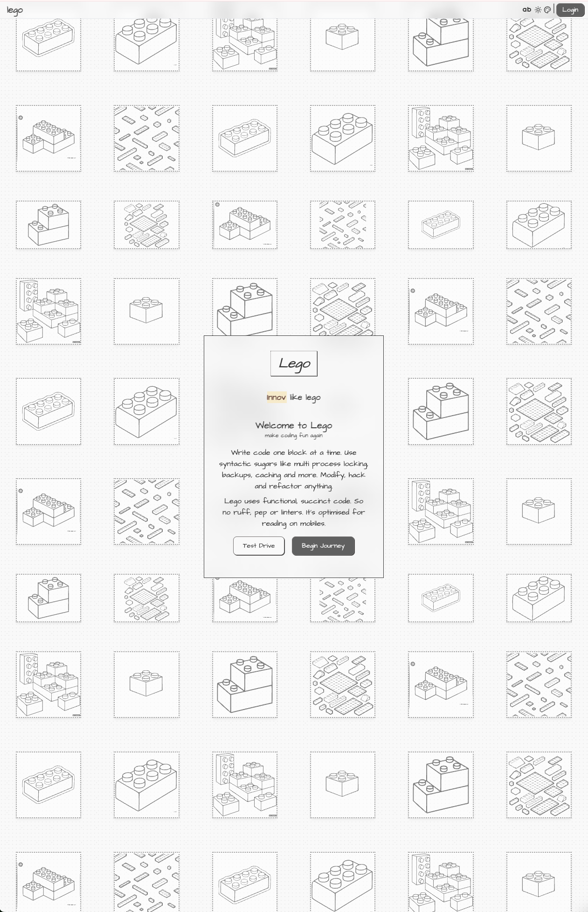

# Lego



Build scalable, maintainable, performant web applications one block at a time.
This is the app framework that powers vedicreader.com, a modern web application for reading Vedic texts.
[Live Demo](https://vedicreader.com/)

## Overview

Lego is a modular Python web framework designed to help developers build modern web applications with a component-based approach. It combines the power of FastHTML and MonsterUI with a comprehensive set of built-in features to create performant, maintainable web applications.

## Core Features

### Authentication (auth)
- **Complete Auth Pipeline**: Login, registration, password reset, email verification
- **Social Authentication**: Configurable Google and GitHub OAuth integration
- **Resend Integration**: Modern email service for auth communications

### Core Infrastructure
- **Intelligent Logging**: 
  - `quick_lgr` automatically finds the calling file, creates a log file, and returns info, error, and warning functions
  - Configurable file and stream logging with rotation support
- **Flexible Caching**: 
  - Both Redis and SQLite implementations built-in
  - Simple decorator-based caching with TTL and auto-refresh
- **Automated Backups**: 
  - Scheduled backups with age-based retention policies
  - Compression and archiving capabilities
- **Cloud Storage**: 
  - Optional cloning to cloud buckets via rclone
  - Support for various cloud providers
- **Modern UI Components**: 
  - Responsive UI components with MonsterUI
  - Light/dark mode and customizable themes
- **Database Support**: 
  - **SQLite Database**: Simple database integration with WAL mode for performance
  - **FastSQL Support**: Can replace FastLite to load PostgreSQL or other databases normally loaded through SQLAlchemy


## Installation

```bash
# Clone the repository
git clone https://github.com/karthik777/lego.git
cd lego

# Using uv (recommended)
uv venv
uv pip install -e .
```

## Quickstart

1. **Start the server**

```bash
python main.py
```

2. **Visit your application**

Open your browser and navigate to: http://localhost:5001

## Project Structure

```
lego/
├── main.py              # Main application entry point
├── lego/
│   ├── auth/            # Authentication module
│   │   ├── app.py       # Auth routes and connections
│   │   ├── cfg.py       # Auth configuration
│   │   ├── data.py      # Auth data models and logic
│   │   └── ui.py        # Auth UI components
│   ├── core/            # Core functionality
│   │   ├── backups.py   # Backup and cloud storage
│   │   ├── cache.py     # Caching implementations
│   │   ├── cfg.py       # Core configuration
│   │   ├── logging.py   # Logging utilities
│   │   └── ui.py        # UI components and helpers
├── config-templates/    # Configuration templates for deployment
│   ├── cloudflare.ini   # Cloudflare DNS validation config
│   ├── default.conf     # Nginx configuration for SWAG
│   ├── rclone.conf      # Rclone configuration for cloud storage
│   └── tunnelconfig.yml # Cloudflare Tunnel configuration
├── data/                # Application data
│   ├── db/              # Database files
│   └── logs/            # Log files
├── static/              # Static assets
├── Dockerfile           # Docker container definition
├── docker-compose.yml   # Docker Compose configuration
└── pyproject.toml       # Project dependencies
```

## Philosophy

Lego is built on the concept of modular, composable blocks. Each block can:

- Set configuration defaults and extend its config with other configs
- Be completely standalone (own config, database, dependencies)
- Build on top of other blocks (use existing databases, config from one or more components)
- Partially depend on other blocks (use some of the blocks' config or helper methods)

### Why?

- **Reusability**: Blocks can be reused across different applications
- **Scalability**: Add new features without modifying existing code
- **Maintainability**: Clean separation of concerns for easier debugging and testing
- **Performance**: Optimize each block for speed and efficiency
- **Flexibility**: Mix and match blocks to create custom applications
- **Security**: Isolate sensitive data and logic in separate blocks
- **Consistency**: Follow a consistent structure and coding style across blocks
- **Environment Generation**: Generate environment files, SQLite DB automatically from defaults

This approach allows you to create reusable components that can be mixed and matched to build different applications while maintaining clean separation of concerns.

## Creating Your First Block

Lego follows a modular approach where each feature is a "block" that can be connected to the main application:

1. Create a new directory for your block (e.g., `myblock/`)
2. Create the following files in your block:
   - `__init__.py` - Export your `connect` function
   - `app.py` - Define your routes and `connect` function
   - `cfg.py` - Configuration for your block
   - `ui.py` - Create UI components
   - `data.py` - Define data models and logic

3. Connect your block in `app.py`:

```python
import myblock

# connect your blocks. you can override the routes in blocks placed before the last one
myblock.connect(app)
```

## Example Block Structure

The auth block provides a complete authentication system that can be easily connected to your app:

```python
# In auth/app.py
def connect(app, prefix="/a"):
    setup_oath(app)
    app.before.append(before)
    Routes.base = prefix
    app.get("/")(welcome)
    app.get(Routes.login)(login)
    app.post(Routes.login)(process_login)
    # ... more routes
```

## Code Examples

### Quick Logger

```python
from lego.core.logging import quick_lgr

# Automatically creates a logger based on the current file
info, error, warn = quick_lgr()
info("This is an info message")
```

### Caching

```python
from lego.core.cache import cache

@cache(ttl=3600)  # Cache for 1 hour
def expensive_function(param1, param2):
    # Function result will be cached
    return complex_calculation(param1, param2)
```

### Automated Backups

```python
from lego.core.backups import run_backup, clone

# Create a backup with age-based retention
run_backup(src="data/important", max_ages="2,14,60")

# Clone to cloud storage
clone(src="static", bucket="my-app-assets")
```

### Route Overrides

```python
from lego.core import RouteOverrides

# Override default login and logout routes
RouteOverrides.lgn = "/custom-login"
RouteOverrides.lgt = "/custom-logout"
RouteOverrides.home = "/dashboard"

# Add routes to skip authentication
RouteOverrides.skip = ["/public", "/api/health"]
```

### Scheduler

```python
from lego.core.utils import scheduler

# Schedule a job to run every day at 8:00 and 20:00
scheduler.add_job(my_function, trigger='cron', hour='8,20', minute=0)

# Schedule a job to run every 24 hours
scheduler.add_job(my_function, trigger='interval', hours=24, id='daily_job')

# Schedule a job to run once after 5 minutes
scheduler.add_job(my_function, trigger='date', run_date=datetime.now() + timedelta(minutes=5))
```

### CSS and JS Utilities

```python
from lego.core.utils import minjs, mincss, loadX

# Minify JavaScript
minified_js = minjs(js_code)

# Minify CSS
minified_css = mincss(css_code)

# Load a file with variable substitution and minification
js_content = loadX('path/to/file.js', kw={'variable': 'value'}, minify=True)
```

### UI Components

```python
from lego.core.ui import landing, base, navbar

# Create a landing page
def my_landing_page(req):
    content = Div("Welcome to my app", cls="text-center")
    return landing(content, title="My App")

# Create a base layout with navbar
def my_page(req):
    content = Div("Page content", cls="p-4")
    return base(content, title="My App", style="glass")

# Create a custom navbar
custom_navbar = navbar(usr=user_data, title="My App", style="shining")
```

### JavaScript Integration

```python
from lego.core.utils import init_js_then_use

# Initialize a JavaScript library and use it once loaded
def my_component():
    script, code = init_js_then_use(
        script_src="/static/js/chart.js",
        pkg_name_in_js="Chart",
        js_code="new Chart(document.getElementById('chart'), config);"
    )
    return Div(script, code, id="chart")
```

### Front-end Caching with themes.js

The `themes.js` file provides easy front-end caching through localStorage:

```javascript
// Store a value in localStorage
storeState('key', 'value');

// Get a value from localStorage
const value = getState('key');

// Remove a value from localStorage
removeState('key');

// Set theme-related properties
setTheme('dark');
setMode('auto');
setFont('large');
```

### Static File Serving

Lego uses Nginx for static file serving because it's faster than any Python framework:

```nginx
# In config-templates/default.conf
location /static/ {
    alias /config/static/;
    try_files $uri $uri/ =404;
    expires 1y;
    add_header Cache-Control "public, max-age=31536000";
    gzip location;
    gzip_types text/css application/javascript image/svg+xml;
    access_log off;
}
```

### Tailwind CSS Integration

During development, use the Tailwind CLI to watch for changes and generate the CSS:

```bash
npx tailwindcss@3 -i ./lego/core/css/tailwind.input.css -o ./lego/core/css/theme.css --watch
```

This ensures that the output `theme.css` file includes all the classes used in your templates.

### Frameworks Used

Lego leverages several powerful front-end frameworks:

- **Underscore.js**: Utility library for functional programming
- **Surreal.js**: DOM manipulation and event handling
- **HTMX**: AJAX, CSS Transitions, WebSockets without JavaScript
- **Lenis**: Smooth scrolling library

## Code Style and Philosophy

Lego intentionally does not use ruff, PEP 8, or other standard Python formatting tools. Instead, it embraces a functional programming approach with these principles:

- **No Fluff**: Succinct code that focuses on functionality over form
- **Mobile-Friendly**: Code that's easier to read on mobile devices with fewer lines and less indentation
- **Maintainability**: Less code means less maintenance and fewer bugs
- **Functional Programming**: Pure functions that are easier to test, reason about, and reuse
- **Testing Benefits**: When functional code is used across the codebase, you get testing for free as functions are naturally tested through usage
- **Readability Over Convention**: Prioritizes human readability over strict adherence to formatting conventions

## Docker Deployment

Lego comes with a complete Docker setup for easy deployment, including:

- Multi-stage build with uv for efficient dependency management
- SWAG (Secure Web Application Gateway) for SSL/TLS and reverse proxy
- Redis for caching
- Cloudflare Tunnel integration for secure remote access

### Quick Start with Docker

```bash
# Clone the repository
git clone https://github.com/karthik777/lego.git
cd lego

# Create a .env file with your configuration
cp .env.example .env
# Edit .env with your settings
nano .env

# Start the containers
docker-compose up -d
```

### Configuration Templates

The `config-templates` directory contains configuration files that are used during deployment:

- **default.conf**: Nginx configuration for the SWAG container, setting up SSL and proxying requests to the app
- **cloudflare.ini**: Configuration for Cloudflare DNS validation when obtaining SSL certificates
- **rclone.conf**: Configuration for cloud storage integration with services like Cloudflare R2
- **tunnelconfig.yml**: Configuration for Cloudflare Tunnel, enabling secure remote access without opening ports

When using the SWAG container, these files need to be copied to the appropriate locations. Remember to copy the actual key values:

```bash
# Copy the Nginx configuration
cp config-templates/default.conf /etc/swag/nginx/site-confs/

# Copy the Cloudflare DNS validation configuration
cp config-templates/cloudflare.ini /etc/swag/dns-conf/

# Copy the Cloudflare Tunnel configuration
cp config-templates/tunnelconfig.yml /etc/swag/
```

The Docker Compose setup will automatically mount these directories and use environment variables to populate the configuration files.

## Serverless Deployment

Lego can be deployed on serverless infrastructure by:

1. **Using fsspec for Remote Storage**: Modify the `get_path` function in `core/cfg.py` to point to remote buckets:

```python
# Example modification of get_path to use fsspec for remote storage
import fsspec

def get_path(nm, sf='', mk=False):
    # Use fsspec to point to a remote bucket (S3, GCS, etc.)
    remote_path = f"s3://my-bucket/{sf}/{nm}" 
    fs = fsspec.filesystem('s3')

    if mk and not fs.exists(remote_path):
        fs.touch(remote_path)

    return remote_path
```

## Roadmap
- 🚀 **Deployment to Fly.io**: Native SQLite support
- 📨 **Email integration**: Self-hosted email server with emailwiz
- 🗄️ **PostgreSQL support**: Additional database option
- 📊 **Admin dashboard**: Built-in interface for managing application data
- 🧪 **Testing utilities**: Helpers for testing blocks and components
- 📚 **Documentation generator**: Automatic documentation for blocks and APIs

## Target Audience

Lego is designed for:

- **Web Developers** who want a modular, component-based approach to building web applications
- **Python Developers** looking for a modern alternative to traditional web frameworks
- **Rapid Prototypers** who need to quickly build functional web applications with authentication
- **Teams** that want to organize code into reusable, maintainable blocks

## License

MIT
