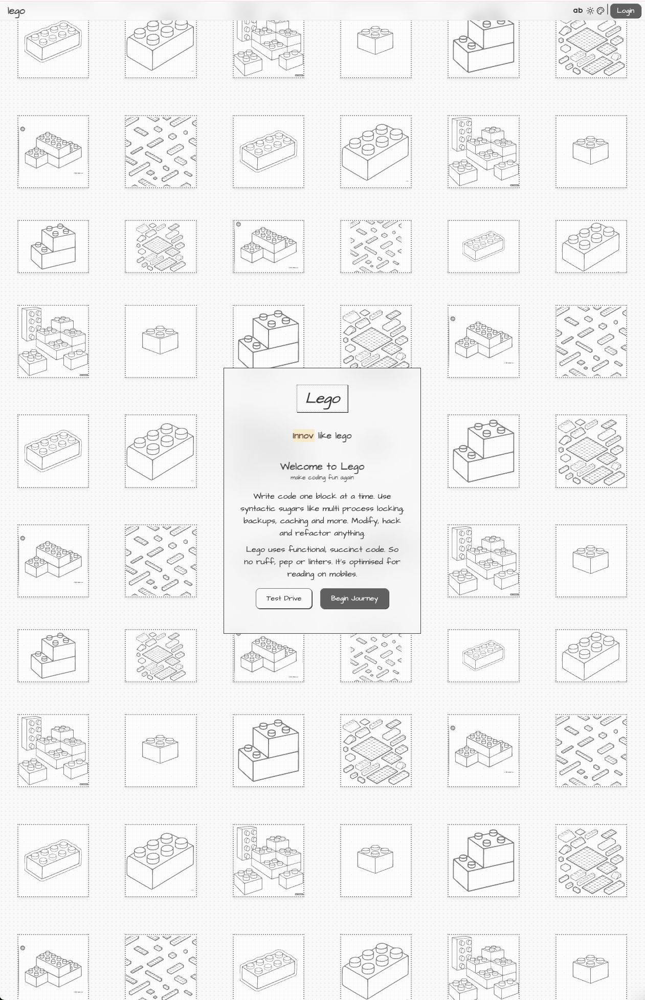

# Lego



Build scalable, maintainable, performant web applications one block at a time.
Powers [vedicreader.com](https://vedicreader.com/).

## Overview

Lego is a modular Python web framework built on FastHTML and MonsterUI. Each feature is a self-contained "block" you connect to the main app — auth, backups, scheduling, and UI components are all included out of the box.

## Core Features

- **Authentication**: Email/password + Google and GitHub OAuth, email verification, password reset
- **Logging**: `quick_lgr` auto-discovers the calling file and returns `(info, error, warn)` functions
- **Caching**: DiskCache-backed decorator with TTL and stampede protection
- **Backups**: Scheduled local backups with age-based retention + optional cloud sync via rclone
- **UI Components**: MonsterUI components with light/dark mode and theme switching
- **Database**: SQLite with FastLite (WAL mode); drop in FastSQL for PostgreSQL

## Installation

```bash
git clone https://github.com/karthik777/lego.git
cd lego
uv sync
```

## Quickstart

```bash
python main.py
# Visit http://localhost:5001
```

## Project Structure

```
lego/
├── main.py              # Entry point
├── lego/
│   ├── auth/            # Authentication block
│   │   ├── app.py       # Routes and connect()
│   │   ├── cfg.py       # OAuth clients and route config
│   │   ├── data.py      # User models, OAuth handlers, login logic
│   │   └── ui.py        # Login/register/reset UI components
│   ├── core/
│   │   ├── cfg.py       # Config, logging, caching, utilities
│   │   ├── ui.py        # Page layouts, navbar, theme components
│   │   ├── utils.py     # Scheduler, JS/CSS minification
│   │   ├── backups.py   # Local and cloud backup
│   │   ├── theme.css    # Compiled Tailwind CSS
│   │   └── theme.js     # Frontend theme management
├── data/
│   ├── db/              # SQLite databases
│   ├── logs/            # Log files
│   └── cache/           # DiskCache storage
├── static/              # Static assets
└── pyproject.toml
```

## Philosophy

Each block is self-contained: its own config, database, and routes. Blocks can also build on each other — using a shared database or borrowing config from another block. Connect them all in `app.py`:

```python
import myblock
myblock.connect(app)
```

**Why blocks?** Reusability, clean separation of concerns, and easy testing. Functional code that's exercised naturally through usage gets tested for free.

Lego intentionally skips ruff/PEP 8. It favors succinct, functional code that reads well on any screen.

## Authentication

The auth block handles the full authentication pipeline. Connect it once and it registers all routes, sets up session middleware, and configures OAuth.

### Setup

```python
# In app.py
import lego.auth as a
a.connect(app)
```

### Email/Password

Registration creates a `pending` user and sends a verification email via Resend. Once verified, the user is `active`. Password reset uses a JWT link sent to the registered address.

Required env var:
```
RESEND_API_KEY=re_...
```

### Google OAuth

```
WANT_GOOGLE=true
G_CLI_ID=your-google-client-id
G_CLI_SCRT=your-google-client-secret
```

The callback URL to register in Google Cloud Console:
```
{DOMAIN}/a/google/callback
```

On success, the user is created or updated with `auth_provider='google'` and marked `active` immediately — no email verification needed.

### GitHub OAuth

```
WANT_GITHUB=true
GIT_CLI_ID=your-github-client-id
GIT_CLI_SCRT=your-github-client-secret
```

Callback URL to register in GitHub OAuth App settings:
```
{DOMAIN}/a/github/callback
```

Same as Google: user is created or matched by `provider_user_id` and activated immediately.

### Auth Routes

| Route | Purpose |
|-------|---------|
| `GET /a/lgn` | Login page |
| `POST /a/lgn` | Process email/password login |
| `GET /a/google/callback` | Google OAuth callback |
| `GET /a/github/callback` | GitHub OAuth callback |
| `GET /a/ok` | Returns 200 if authenticated, 401 otherwise |
| `GET /a/err` | OAuth error page |

### Route Overrides

```python
from lego.core import RouteOverrides

RouteOverrides.lgn = "/login"
RouteOverrides.lgt = "/logout"
RouteOverrides.home = "/dashboard"
RouteOverrides.skip = ["/public", "/api/health"]
```

### User Table

```
users: id, email, password_hash, status (pending/active/suspended/deleted),
       display_name, avatar_url, auth_provider, provider_user_id,
       last_active_at, preferences, created_at, updated_at
```

## Code Examples

### Logging

```python
from lego.core import quick_lgr

info, error, warn = quick_lgr()
info("Server started")
```

`quick_lgr` uses the caller's filename as the log file name automatically.

### Caching

```python
from lego.core import cache

@cache(ttl=3600)
def expensive_function(param1, param2):
    return complex_calculation(param1, param2)
```

Cache keys are scoped per function using `__qualname__` plus call arguments — no collisions between functions with the same signature.

### Backups

```python
from lego.core.backups import run_backup, clone

run_backup(src="data/db", max_ages="2,14,60")  # keep 2-day, 14-day, 60-day backups
clone(src="data/db", bucket="my-app-db")        # sync to Cloudflare R2 or S3
```

### Scheduler

```python
from lego.core.utils import scheduler

scheduler.add_job(my_function, trigger='cron', hour='8,20', minute=0)
scheduler.add_job(my_function, trigger='interval', hours=24, id='daily_job')
```

### CSS and JS Utilities

```python
from lego.core.utils import minjs, mincss, loadX

minified_js = minjs(js_code)
minified_css = mincss(css_code)
js_content = loadX('path/to/file.js', kw={'variable': 'value'})
```

### UI Components

```python
from lego.core.ui import landing, base, navbar

def index(req):
    return landing(Div("Welcome", cls="text-center"))

def dashboard(req, usr):
    return base(Div("Content", cls="p-4"), usr=usr)
```

### Frontend State (theme.js)

```javascript
storeState('key', 'value');
const value = getState('key');
setTheme('dark');
setMode('auto');
setFont('large');
```

## Deployment

Lego runs on any ASGI host. For Fly.io (recommended for SQLite apps):

```bash
fly launch
fly deploy
```

For remote storage, swap `get_pth` in `core/cfg.py` to point at an S3 bucket via `fsspec`.


## License

MIT
